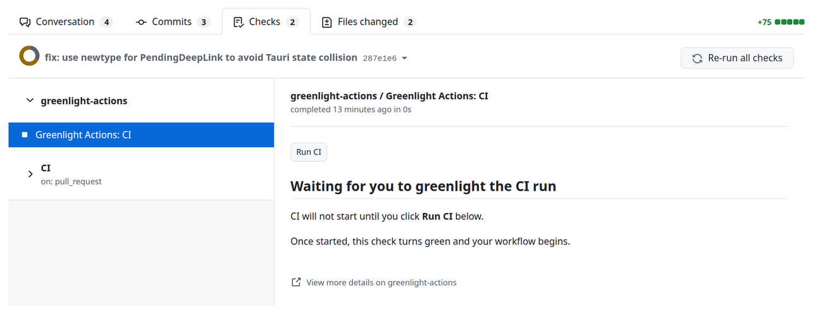
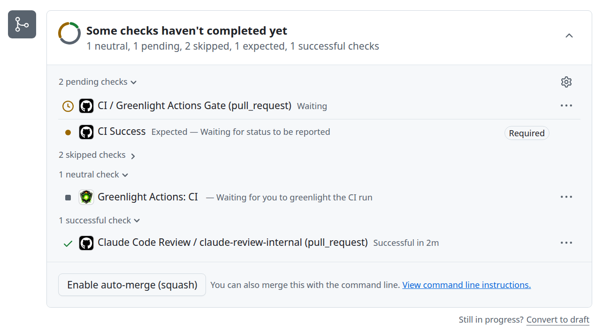
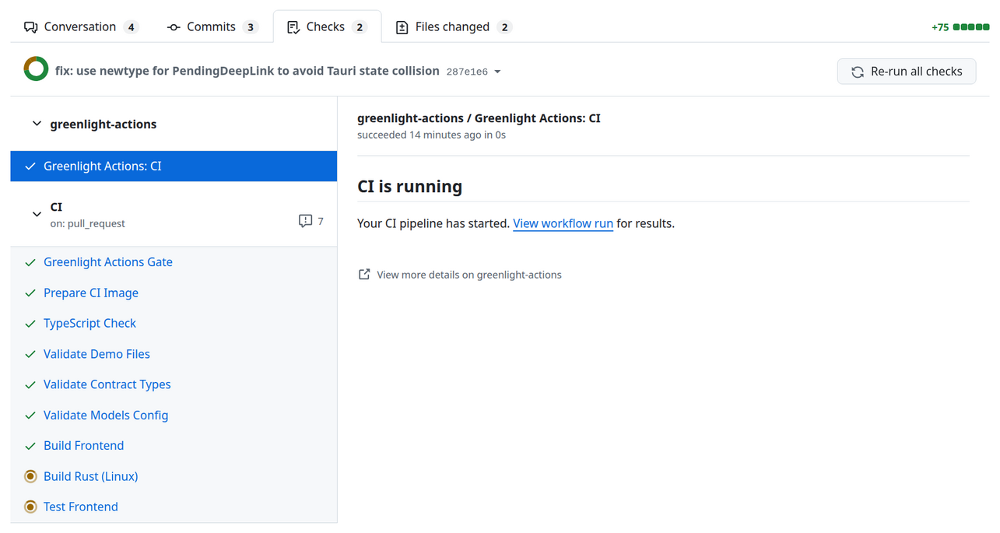
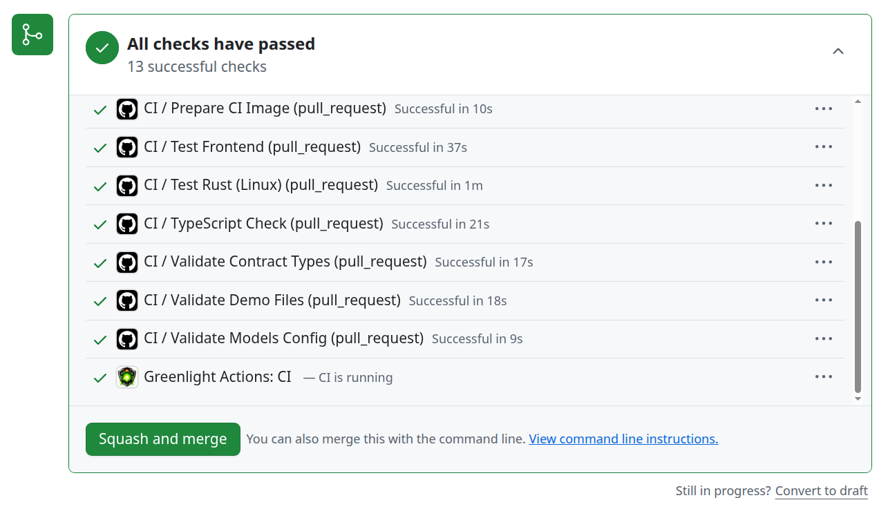
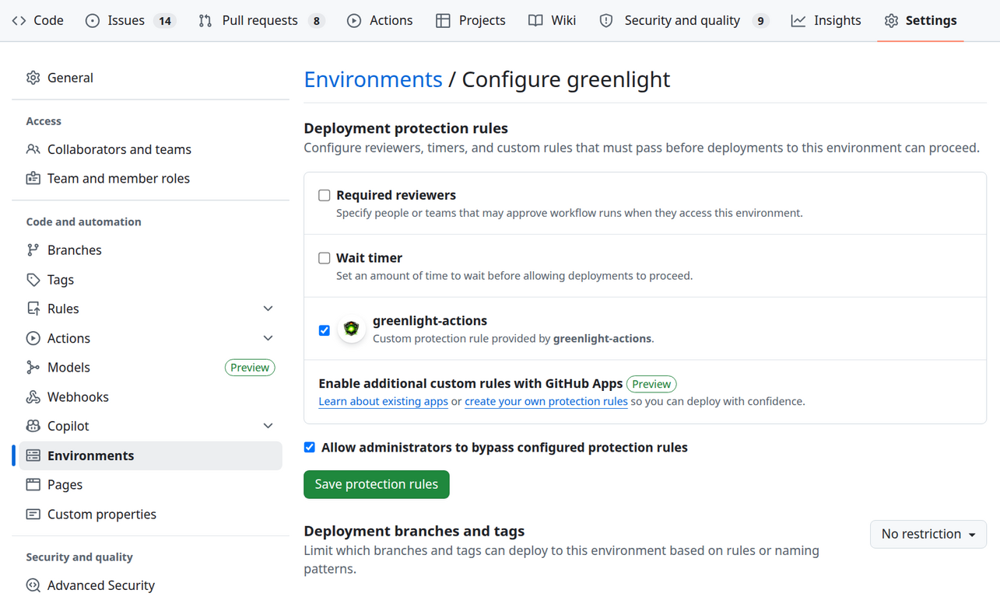

<p align="center">
  
</p>

# Greenlight Actions

Gate CI behind manual approval. Zero wasted minutes.

[](https://github.com/apps/greenlight-actions)

Every push triggers your CI. Greenlight pauses the expensive part until you click "Run CI" — so WIP commits, typo fixes, and mid-rebase pushes cost you nothing.

**Free.** One-click install, one line of YAML, setup in under two minutes.

<p align="center">
  
</p>

<p align="center">
  <picture>
    <source media="(prefers-color-scheme: dark)" srcset="assets/screenshots/product/checks-waiting-dark.png">
    
  </picture>
</p>

---

## How It Works

1. **You push code to a PR.** Your workflow triggers normally, but the CI job pauses at the Greenlight gate. A check appears with a "Run CI" button.

   <p align="center">
     <picture>
       <source media="(prefers-color-scheme: dark)" srcset="assets/screenshots/product/checks-pending-dark.png">
       
     </picture>
   </p>

2. **You click when ready.** One click approves the gate and your CI job continues. No context switching, no CLI commands, no waiting for a build you did not want.

   <p align="center">
     <picture>
       <source media="(prefers-color-scheme: dark)" srcset="assets/screenshots/product/checks-running-dark.png">
       
     </picture>
   </p>

3. **CI finishes and checks go green.** All checks pass and you're ready to merge.

   <p align="center">
     <picture>
       <source media="(prefers-color-scheme: dark)" srcset="assets/screenshots/product/checks-passed-dark.png">
       
     </picture>
   </p>

4. **You push again, the gate resets.** Every new commit re-triggers the workflow and pauses it again, so stale green checks never linger on changed code.

Your workflow file stays the same. Greenlight only controls _when_ the work runs.

> **How is this different from polling-based solutions?** Greenlight uses GitHub's [deployment protection rules](https://docs.github.com/en/actions/managing-workflow-runs-and-deployments/managing-deployments/creating-custom-deployment-protection-rules). The workflow truly pauses — zero Actions minutes are consumed while waiting for approval.

---

## Get Started

### 1. Install Greenlight

[Install Greenlight](https://github.com/apps/greenlight-actions) on your GitHub organization or repositories. Setup takes under a minute. The `greenlight` environment is created automatically — here's what it looks like:

<p align="center">
  <picture>
    <source media="(prefers-color-scheme: dark)" srcset="assets/screenshots/product/settings-environment-dark.png">
    
  </picture>
</p>

### 2. Add the Greenlight Environment to Your Job

Add `environment: greenlight` to any job you want Greenlight to gate. Keep your existing triggers — Greenlight works alongside them.

```yaml
# .github/workflows/ci.yml
name: CI

on:
  pull_request:

jobs:
  build:
    runs-on: ubuntu-latest
    environment: greenlight
    steps:
      - uses: actions/checkout@v4
      # ... your existing steps unchanged
```

### 3. Open a Pull Request

Push a branch and open a PR. Your workflow will start, pause at the `greenlight` environment gate, and you will see a "Greenlight Actions: CI" check with a "Run CI" button. Click it when your code is ready.

That is it. No config files, no dashboard, no CLI. Setup takes under two minutes.

### Workflows That Also Run on Push

If your workflow also runs on `push` (e.g., to run CI after merging to `main`), conditionally apply the environment so the gate only fires on PRs:

```yaml
# .github/workflows/ci.yml
name: CI

on:
  pull_request:
  push:
    branches: [main]

jobs:
  build:
    runs-on: ubuntu-latest
    environment: ${{ github.event_name == 'pull_request' && 'greenlight' || '' }}
    steps:
      - uses: actions/checkout@v4
      # ... your existing steps unchanged
```

On a pull request, the job uses the `greenlight` environment and pauses at the gate. On a push to `main`, the expression evaluates to an empty string (no environment), so the job runs immediately with no gate.

> **Why not use environment branch restrictions instead?** GitHub's environment branch restrictions (Settings > Environments > Deployment branches) will _fail_ the job on disallowed branches rather than skip the gate. The conditional environment approach above is more reliable and does not require a paid GitHub plan for private repositories.

---

## Why Greenlight

| What Changes | Before Greenlight | After Greenlight |
|---|---|---|
| CI minutes on WIP pushes | Every push burns compute | Workflows pause until you click "Run CI" — zero minutes burned |
| Red checks on incomplete code | Failures train your team to ignore CI | Checks stay neutral until you explicitly trigger |
| Stale green checks | Outdated commits show false confidence | Every push resets the gate automatically |
| Setup complexity | Custom scripts, branch rules, or Enterprise plans | One line of YAML, free on all GitHub plans |

### Alternatives Compared

| Alternative | Limitation Greenlight Solves |
|------------|---------------------------|
| GitHub Environment Required Reviewers | Requires Enterprise ($21/user/mo) for private repos |
| Polling-based approval Actions | Burns Actions minutes while waiting for approval |
| Removing `pull_request` trigger entirely | Terrible DX — requires navigating to Actions tab, entering branch name |
| `concurrency` + `cancel-in-progress` | Doesn't prevent the initial trigger, just cancels overlapping runs |

### Who This Is NOT For

- **Teams that want every push tested automatically.** Greenlight adds a manual step — if your workflow is "push and forget," this adds friction you don't want.
- **Workflows outside GitHub Actions.** Greenlight is GitHub-native and only works with GitHub Actions.
- **Fork-based contribution workflows.** Deployment protection rules don't apply to workflows triggered from forks.

---

## Security and Privacy

Greenlight is designed to touch as little as possible.

- **Stateless.** No database, no file storage, no persistent state of any kind. Every request is processed and forgotten.
- **No code access.** Greenlight never reads, clones, or stores your source code. It only interacts with the Checks and Deployments APIs.
- **No secrets exposure.** It never sees or handles your repository secrets, tokens, or environment variables.
- **No logging of content.** Webhook payloads are processed in memory and discarded. Nothing is written to disk or sent to third parties.
- **Minimal permissions.** Only the permissions strictly required to create check runs and approve deployment protection rules.

### Permissions Explained

Greenlight requests the minimum permissions required to function:

| Permission | Access | Why |
|------------|--------|-----|
| **Checks** | Read & Write | Create the "Greenlight Actions: CI" check run on PRs, update its status when CI starts |
| **Actions** | Read & Write | Approve deployment protection rules to allow gated CI jobs to proceed |
| **Deployments** | Read & Write | Respond to deployment protection rule requests from GitHub |
| **Pull Requests** | Read | Read PR metadata (branch, SHA, repository) to associate checks with the correct commit |

The app subscribes to two webhook events:

- **Deployment protection rule** (`requested`) — to create the check run with a "Run CI" button when a workflow pauses at the `greenlight` environment gate
- **Check run** (`requested_action`) — to respond when a developer clicks the "Run CI" button

---

## FAQ

**No check is appearing on my PR.**
Make sure the job in your workflow has `environment: greenlight` set. The Greenlight gate only activates when the workflow reaches that environment.

**The check appeared but nothing happens when I click "Run CI".**
Verify that the Greenlight app is installed on the repository (not just the organization). Check Settings > Integrations > GitHub Apps.

**Does Greenlight work on forked PRs?**
No. Deployment protection rules are a repository-level feature and do not apply to workflows triggered from forks.

**Can I gate multiple jobs in the same workflow?**
Yes. Add `environment: greenlight` to each job you want to gate. Each job gets its own independent "Run CI" button.

**Does Greenlight work with private repositories?**
Yes. Deployment protection rules work on both public and private repositories on all GitHub plans.

**What happens if nobody clicks "Run CI"?**
The workflow run stays in a "waiting" state. GitHub's deployment protection rules have a 30-day timeout, but in practice the workflow run will be cancelled by GitHub's own run timeout first (default: 6 hours, configurable via `timeout-minutes`). No Actions minutes are consumed while waiting.

**How do I remove Greenlight?**
Remove `environment: greenlight` from your workflow files, then uninstall the app from Settings > Integrations > GitHub Apps. No data cleanup is needed — Greenlight stores nothing.

---

## Support

See [SUPPORT.md](SUPPORT.md) for how to get help, report bugs, or request features.

---

## Built by Praxiom Systems

Greenlight is built and maintained by [Praxiom Systems LLC](https://praxiomsystems.com/). It is open-source ([MIT](LICENSE)), stateless, and never touches your code or secrets. Read our [privacy policy](PRIVACY.md) and [security policy](SECURITY.md).

---

## License

[MIT](LICENSE) — Copyright (c) 2026 [Praxiom Systems LLC](https://praxiomsystems.com/)
